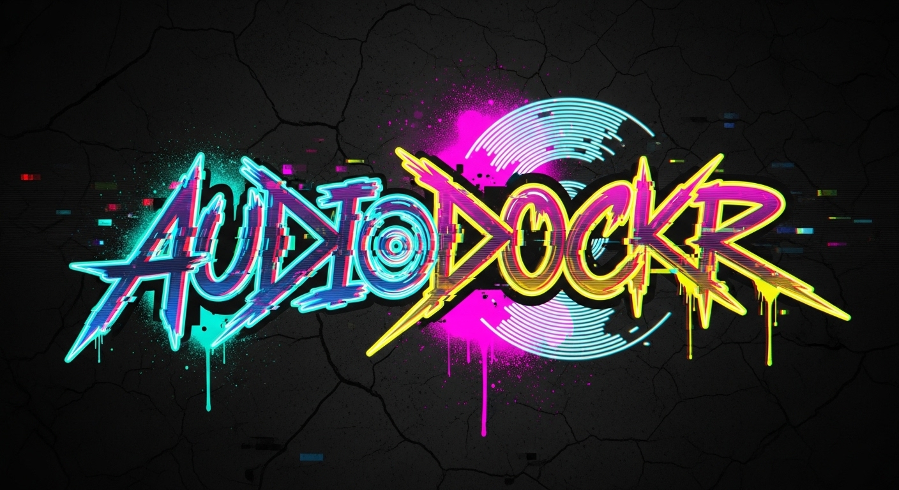

<div id="top">

<!-- HEADER STYLE: COMPACT -->


# <code>❯ AudioDockr</code>
<em>Local-first Flutter music player with Android-native playback, persistent library data, and automated APK releases on GitHub.</em>

<!-- BADGES -->
<!-- local repository, no metadata badges. -->

<em>Built with the tools and technologies:</em>


<br>


<br clear="left"/>

## ☀️ Table of Contents

1. [🌞 Overview](#-overview)
2. [🔥 Features](#-features)
3. [🌅 Project Structure](#-project-structure)
4. [🚀 Getting Started](#-getting-started)
    4.1. [🌟 Prerequisites](#-prerequisites)
    4.2. [⚡ Installation](#-installation)
5. [🤝 Contributing](#-contributing)
6. [📜 License](#-license)

---

## 🌞 Overview

AudioDockr is a Flutter-based Android music player that keeps its core UX in Dart while using native Kotlin playback plumbing for media controls, audio focus, and notification handling.

The project now includes:

- Android-native playback and media session integration
- Persistent local data for playlists, likes, recents, and search history
- Automatic Git-based Android version naming during build
- A GitHub Actions workflow that builds and publishes the latest release APK to the repo Releases page on every push

---

## 🔥 Features

- Search YouTube-backed music content from the app
- Play audio with native Android media controls
- Save liked songs, recents, and custom playlists locally
- Add tracks to custom playlists from the player
- Auto-generate Android app version names from the current Git revision
- Auto-build and publish `app-release.apk` to GitHub Releases via Actions

### Automated APK Release

Every push to the GitHub repository now triggers:

1. `flutter pub get`
2. `flutter build apk --release`
3. upload of the latest `app-release.apk` to the repository Releases page

Workflow file:

- `.github/workflows/android-release.yml`

Release behavior:

- the workflow updates a rolling prerelease tagged `continuous`
- the newest APK replaces the previous one
- Android `versionName` is derived from Git, for example:
  - `b43fce4`
  - `b43fce4-dirty`

---

## 🌅 Project Structure

```sh
lib/
├── api/
│   └── youtube_service.dart
├── providers/
│   ├── library_provider.dart
│   ├── playback_provider.dart
│   └── search_provider.dart
├── screens/
│   ├── downloads_screen.dart
│   ├── home_screen.dart
│   ├── library_screen.dart
│   ├── now_playing_screen.dart
│   ├── search_screen.dart
│   ├── settings_screen.dart
│   └── shell.dart
├── services/
│   └── native_player_service.dart
├── widgets/
│   ├── app_bottom_bar.dart
│   ├── infinite_marquee_text.dart
│   ├── mini_player.dart
│   └── playlist_sheets.dart
├── database_helper.dart
├── main.dart
└── theme.dart
```

---

## 🚀 Getting Started

### 🌟 Prerequisites

This project requires the following dependencies:

- Flutter SDK
- Android Studio or Android SDK
- A connected Android device or emulator

### ⚡ Installation

Build from source and run the app:

1. **Clone the repository:**

    ```sh
    ❯ git clone https://github.com/SyntaxAdi/AudioDockr.git
    ```

2. **Navigate to the project directory:**

    ```sh
    ❯ cd AudioDockr
    ```

3. **Clean existing dependencies:**

    ```sh
    flutter clean
    ```

4. **Install the app dependencies:**

    ```sh
    flutter pub get
    ```

5. **Start the app or build an APK:**

    ```sh
    flutter run
    ```

    ```sh
    flutter build apk
    ```

---

## 🤝 Contributing

- **💬 [Join the Discussions](https://github.com/SyntaxAdi/AudioDockr/discussions)**: Share feedback, ideas, and design suggestions.
- **🐛 [Report Issues](https://github.com/SyntaxAdi/AudioDockr/issues)**: Submit bugs or request features for AudioDockr.
- **💡 [Submit Pull Requests](https://github.com/SyntaxAdi/AudioDockr/pulls)**: Open a PR with focused, reviewable changes.

<details closed>
<summary>Contributing Guidelines</summary>

1. **Fork the Repository**: Start by forking the project repository to your GitHub account.
2. **Clone Locally**: Clone the forked repository to your local machine using a git client.
   ```sh
   git clone .
   ```
3. **Create a New Branch**: Always work on a new branch, giving it a descriptive name.
   ```sh
   git checkout -b new-feature-x
   ```
4. **Make Your Changes**: Develop and test your changes locally.
5. **Commit Your Changes**: Commit with a clear message describing your updates.
   ```sh
   git commit -m 'Implemented new feature x.'
   ```
6. **Push to GitHub**: Push the changes to your forked repository.
   ```sh
   git push origin new-feature-x
   ```
7. **Submit a Pull Request**: Create a PR against the original project repository. Clearly describe the changes and their motivations.
8. **Review**: Once your PR is reviewed and approved, it will be merged into the main branch. Congratulations on your contribution!
</details>

<details closed>
<summary>Contributor Graph</summary>
<br>
<p align="left">
   <a href="https://github.com/SyntaxAdi/AudioDockr/graphs/contributors">
      
   </a>
</p>
</details>

---

## 📜 License

This repository does not currently include a LICENSE file. Add one before distributing or reusing the project under explicit terms.

<div align="right">

[![][back-to-top]](#top)

</div>


[back-to-top]: https://img.shields.io/badge/-BACK_TO_TOP-151515?style=flat-square


---
